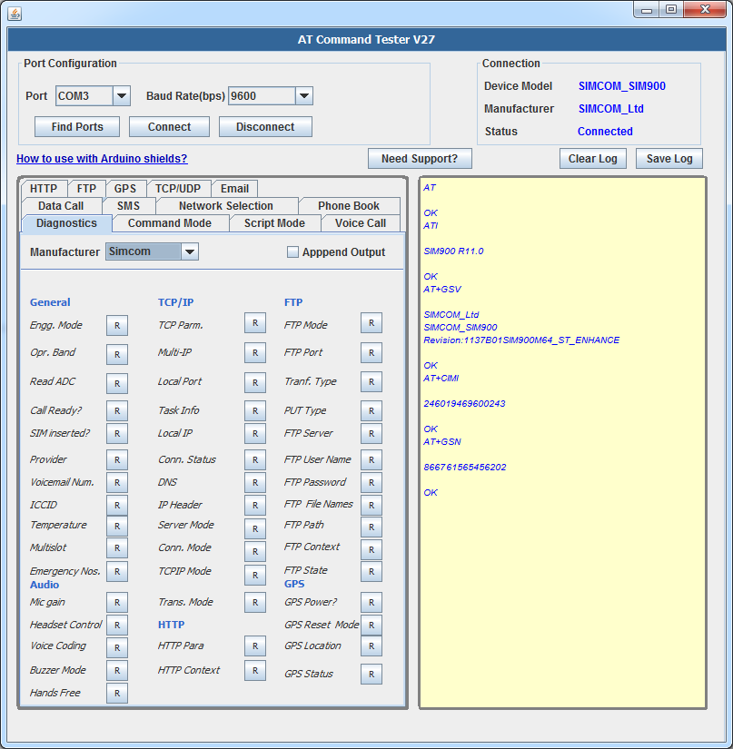

### ATCommandTester

`Test AT commands for GSM modems over serial (RS232/UART) connection with lots of options.`

* Ported and cleaned up version of the ATCommandTester from m2msupport.net
* Standalone & offline - no Java Applet security bullshit
* Still lots of optimizations can be done, e.g. ATCommandTester.java >10k lines!!! seriously?! OMG!
* Grab and enjoy!

***Windows users***

`Run run_x.bat file to launch the program.`

***Screenshots***

